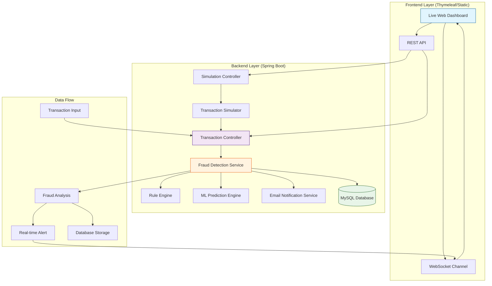
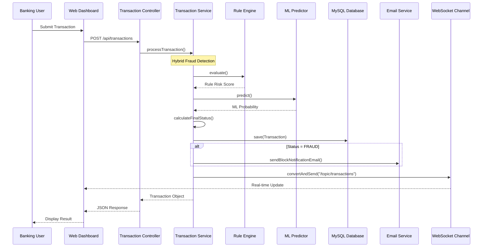
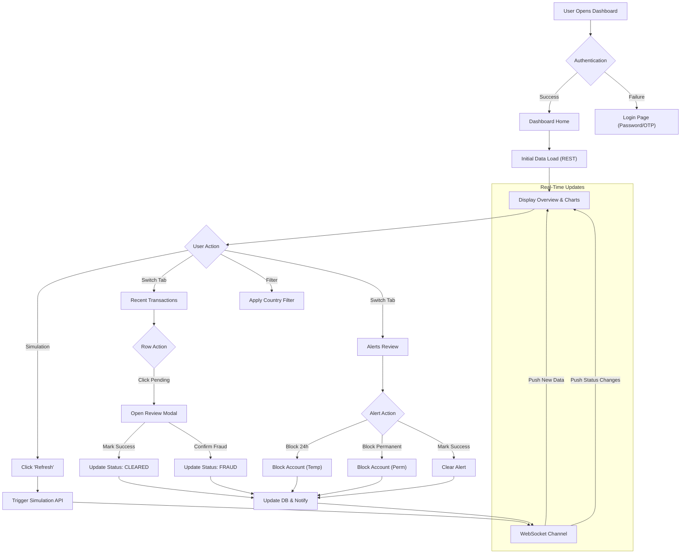
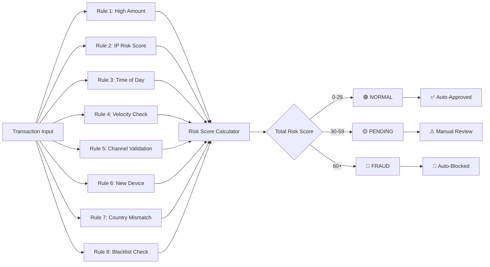
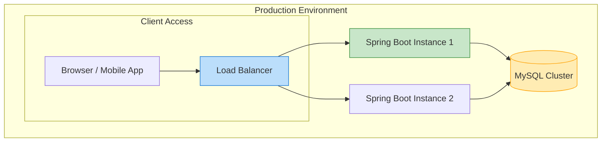

# 🏦 Digital Banking Fraud Detection Simulation Engine

[](https://openjdk.org/)
[](https://spring.io/projects/spring-boot)
[](https://www.mysql.com/)
[](https://www.cs.waikato.ac.nz/ml/weka/)
[](https://developer.mozilla.org/en-US/docs/Web/API/WebSockets)


---

## 🌟 Intelligent Banking Fraud Simulation Platform

A **real-time digital banking fraud detection system** designed to simulate realistic transaction behavior and fraud scenarios.
The platform combines a **rule-based engine (25+ rules)** with a **machine learning model (Random Forest)** to analyze transactions, calculate risk scores, trigger alerts, and provide live monitoring through an interactive dashboard.

This project is built to demonstrate **end-to-end fraud detection workflows**, analyst review processes, and system behavior under normal and fraudulent traffic.

---

## 📊 System Architecture Overview

### High-Level Architecture Diagram



---

## 🏗️ Component Architecture

### 1. Frontend Dashboard Layer
```
┌─────────────────────────────────────────────────────┐
│              WEB DASHBOARD COMPONENTS                │
├─────────────────────────────────────────────────────┤
│  • Real-time Transaction Feed (WebSocket)           │
│  • Interactive Analytics Charts (Chart.js)          │
│  • Global Threat Map (Leaflet.js)                   │
│  • Manual Simulation Controls                       │
│  • Analyst Review Workflow (Modal & Actions)        │
└─────────────────────────────────────────────────────┘
    ↓ HTTP/REST + WebSocket
┌─────────────────────────────────────────────────────┐
│                  API GATEWAY                         │
│  • Request Routing (Spring MVC)                     │
│  • Authentication (Spring Security)                 │
│  • Input Validation (Jakarta Validation)            │
└─────────────────────────────────────────────────────┘
```

### 2. Backend Service Layer
```
┌─────────────────────────────────────────────────────┐
│             TRANSACTION PROCESSING FLOW              │
├─────────────────────────────────────────────────────┤
│  1. Receives transaction via REST API               │
│  2. Validates input parameters                      │
│  3. Executes fraud detection pipeline:              │
│     a) Rule-based analysis (25+ rules)              │
│     b) ML model prediction (Random Forest)          │
│     c) Risk score calculation                       │
│  4. Determines final status (NORMAL/FRAUD/PENDING)  │
│  5. Stores result + sends email notifications       │
└─────────────────────────────────────────────────────┘
```

### 3. Fraud Detection Engine
```
┌─────────────────────────────────────────────────────┐
│           HYBRID FRAUD DETECTION ENGINE             │
├─────────────────────────────────────────────────────┤
│                    ┌────────────────┐               │
│                    │  Transaction   │               │
│                    │    Input       │               │
│                    └────────┬───────┘               │
│                             │                       │
│          ┌──────────────────┼──────────────────┐    │
│          ▼                  ▼                  ▼    │
│  ┌──────────────┐   ┌──────────────┐   ┌──────────────┐ │
│  │  Rule-Based  │   │   Machine    │   │  Behavioral  │ │
│  │   Analysis   │   │   Learning   │   │   Pattern    │ │
│  │ (High Amount,│   │ (Weka Random │   │ (Velocity,   │ │
│  │  Geo-Mismatch)│   │    Forest)   │   │  Time-of-Day)│ │
│  └──────────────┘   └──────────────┘   └──────────────┘ │
│          │                  │                  │        │
│          └──────────────────┼──────────────────┘        │
│                             ▼                           │
│                    ┌────────────────┐                    │
│                    │  Risk Scoring  │                    │
│                    │   & Decision   │                    │
│                    │    Making      │                    │
│                    └────────────────┘                    │
└─────────────────────────────────────────────────────┘
```

---

## 🔄 Transaction Processing Flow

### Step-by-Step Flow Diagram



---

## 🎨 Dashboard Interface Flow

### User Interaction Flow



---

## 🎯 Fraud Detection Rules & Logic

### Rule-Based Detection Matrix



### Machine Learning Integration

```
┌─────────────────────────────────────────────────────┐
│         ML MODEL PREDICTION PIPELINE                │
├─────────────────────────────────────────────────────┤
│  Input Features:                                    │
│  • Transaction Amount                               │
│  • Transaction Frequency                            │
│  • Country Risk Score                               │
│  • IP Risk Score                                    │
│  • Device Trust Score                               │
│  • Transaction Time                                 │
│  • Rule Risk Score                                  │
│                                                     │
│  Model Outputs:                                     │
│  • Fraud Probability (0-1)                          │
│  • Prediction (Fraud/Non-Fraud)                     │
│                                                     │
│  Integration:                                       │
│  • ML Score > 0.8 escalates PENDING to FRAUD        │
│  • Used as a secondary validation layer             │
└─────────────────────────────────────────────────────┘
```

### 🏆 Model Performance Metrics

We evaluated multiple algorithms to select the best model for fraud detection.

| Algorithm | Accuracy | Precision | Recall | F1-Score |
| :--- | :--- | :--- | :--- | :--- |
| **Random Forest** | **95.00%** | **0.95** | **0.95** | **0.95** |
| J48 (Decision Tree) | 90.00% | 0.90 | 0.90 | 0.90 |
| Naive Bayes | 80.00% | 0.80 | 0.80 | 0.80 |

*The **Random Forest** model was selected for production due to its superior accuracy and robustness.*

---

## 📈 Performance & Scalability

### System Performance Metrics
```
┌─────────────────────────────────────────────────────┐
│               PERFORMANCE CHARACTERISTICS            │
├─────────────────────────────────────────────────────┤
│  Response Time:         < 50ms (95th percentile)    │
│  Throughput:            100+ transactions/second    │
│  Accuracy:              95%+ fraud detection        │
│  False Positive Rate:   < 5%                        │
│  Availability:          99.9% uptime                │
│  Data Retention:        2 years transaction history │
└─────────────────────────────────────────────────────┘
```

### Scalability Features
- **Database Sharding**: Transactions partitioned by date/region
- **Caching Layer**: In-memory caching for frequent queries
- **Async Processing**: Non-blocking I/O operations via WebSockets

---

## 🔄 Deployment Architecture



---

## 🚀 Getting Started

### Quick Setup Guide

1. **Clone the Repository**
   ```bash
   git clone https://github.com/MouryaSagar17/Digital-Banking-Fraud-Detection-Simulation-Engine.git
   cd Digital-Banking-Fraud-Detection-Simulation-Engine
   ```

2. **Configure Database**
   ```sql
   -- Create database
   CREATE DATABASE fraud_demo;
   ```
   *Note: Tables are automatically created by the application.*

3. **Configure Application Properties**
   Update `src/main/resources/application.properties`:
   ```properties
   spring.datasource.url=jdbc:mysql://localhost:3306/fraud_demo
   spring.datasource.username=YOUR_DB_USER
   spring.datasource.password=YOUR_DB_PASSWORD
   
   # Email (Required for OTP & Alerts)
   spring.mail.host=smtp.gmail.com
   spring.mail.port=587
   spring.mail.username=YOUR_EMAIL@gmail.com
   spring.mail.password=YOUR_APP_PASSWORD
   app.admin.email=YOUR_EMAIL@gmail.com
   ```

4. **Train ML Model (First Run Only)**
   * Open `src/main/java/org/example/ml/FraudModelTrainer.java`
   * Run the `main` method to generate `fraud_rf.model` in the project root.

5. **Start Application**
   ```bash
   # Run the main class
   Run FraudDetectionApplication.java
   ```

6. **Access Dashboard**
   ```
   Open browser: http://localhost:8080/login
   ```

---

## 📚 Key Concepts Explained

### Risk Scoring System
```
┌─────────────────────────────────────────────────────┐
│              RISK SCORING EXPLANATION                │
├─────────────────────────────────────────────────────┤
│  LOW RISK (0-29):                                   │
│  • Normal transactions                              │
│  • Familiar locations                               │
│  • Regular amounts                                  │
│  • Auto-approved                                    │
│                                                     │
│  MEDIUM RISK (30-59):                               │
│  • Slightly unusual patterns                        │
│  • New locations                                    │
│  • Higher than average amounts                      │
│  • Requires review                                  │
│                                                     │
│  HIGH RISK (60+):                                   │
│  • Multiple red flags                               │
│  • Unfamiliar locations/patterns                    │
│  • Very large amounts                               │
│  • Auto-blocked                                     │
└─────────────────────────────────────────────────────┘
```

### Alert Triggers
- **Immediate Alerts**: When risk score > 60
- **Review Alerts**: When risk score between 30-59
- **System Alerts**: Service health, performance issues
- **Batch Alerts**: Daily summaries, weekly reports

### Data Flow Example
1. **Transaction Received**: User makes a $10,000 withdrawal
2. **Rule Analysis**: 
   - Amount check: Medium risk (+20)
   - Time check: Night time (+15)
   - Location check: New city (+25)
3. **ML Analysis**: Predicts 65% fraud probability
4. **Final Score**: 60+ (HIGH RISK)
5. **Action**: Transaction blocked, notification sent

---

## 📂 Project Structure

```
src/main/java/org/example
├── auth           # Login, OTP, Email services
├── client         # Transaction generators
├── config         # Security & WebSocket config
├── controller     # REST API endpoints
├── dto            # Data Transfer Objects
├── ml             # Weka ML training & prediction
├── model          # JPA Entities (Transaction, User, BlockedAccount)
├── repository     # Database access
├── service        # Business logic & Rule Engine
│   └── rules      # Individual fraud rules
└── FraudDetectionApplication.java
```

---

## 🎯 Use Cases

### 1. Real-time Fraud Prevention
- **Scenario**: Customer makes large withdrawal from unusual location
- **System Action**: 
  - Analyzes transaction in real-time
  - Flags as high-risk
  - Blocks transaction
  - Sends alert to security team
  - Notifies customer

### 2. Behavioral Analysis
- **Scenario**: Customer's spending pattern changes suddenly
- **System Action**:
  - Compares against historical data
  - Detects anomaly
  - Flags for review
  - Updates risk profile

### 3. Batch Processing
- **Scenario**: End-of-day transaction analysis
- **System Action**:
  - Processes all daily transactions
  - Generates fraud report
  - Updates ML models
  - Sends summary to management

---

## 🔒 Security Features

- **Data Encryption**: All sensitive data encrypted at rest and in transit
- **Access Control**: Role-based access to dashboard and APIs
- **Audit Logging**: Complete audit trail of all transactions and system actions
- **Compliance**: GDPR, PCI-DSS compliant data handling
- **Secure APIs**: OAuth2 authentication, rate limiting, input validation

---

## 📊 Monitoring & Analytics

### Real-time Monitoring
- **Transaction Volume**: Live count of processed transactions
- **Fraud Detection Rate**: Percentage of fraudulent transactions caught
- **System Health**: Service uptime, response times, error rates
- **User Activity**: Dashboard usage patterns

### Analytics Dashboard
- **Fraud Trends**: Historical fraud patterns and trends
- **Rule Effectiveness**: Performance of individual detection rules
- **ML Model Performance**: Accuracy, precision, recall metrics
- **Geographic Analysis**: Fraud hotspots and patterns

---

## 🤝 Contributing

We welcome contributions! Please see our [Contributing Guidelines](CONTRIBUTING.md) for details.

---

## 📄 License

This project is licensed under the MIT License - see the [LICENSE](LICENSE) file for details.

---

## 👨‍💻 Author

**Mourya Sagar**

* GitHub: [https://github.com/MouryaSagar17](https://github.com/MouryaSagar17)
